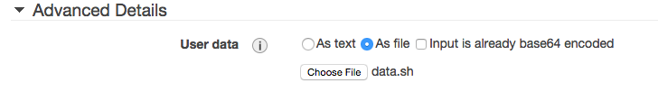

Bootstraping SALT on Linux EC2 with cloud-init
==============================================

In step 3 "Configure instance" in the Advance Details, select option As file and
put the script below.



```sh
#!/bin/sh

export AWS_ACCESS_KEY_ID=the-key
export AWS_SECRET_ACCESS_KEY=the-secret
export AWS_DEFAULT_REGION=eu-west-1

add-apt-repository ppa:saltstack/salt --yes
apt-get --yes -qq install python-software-properties
apt-get --yes -qq update
apt-get --yes -qq upgrade
apt-get --yes -qq install python-pip
pip install awscli

TAG_NAME="Salt"
INSTANCE_ID=$(curl -s http://169.254.169.254/latest/meta-data/instance-id)
REGION=$(curl -s http://169.254.169.254/latest/meta-data/placement/availability-zone | sed 's/.$//')
TAG_VALUE=$(aws ec2 describe-tags --filters "Name=resource-id,Values=${INSTANCE_ID}" "Name=key,Values=$TAG_NAME" --region ${REGION} --output=text | cut -f5)

# hostname
echo ${INSTANCE_ID} > /etc/hostname
hostname -F /etc/hostname

# salt
mkdir /etc/salt
echo ${INSTANCE_ID} > /etc/salt/minion_id
echo "node_type: ${TAG_VALUE}" > /etc/salt/grains
echo "startup_states: highstate" > /etc/salt/minion

apt-get -o Dpkg::Options::="--force-confnew" install -y -qq salt-minion
```
